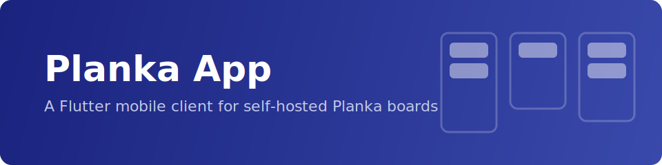
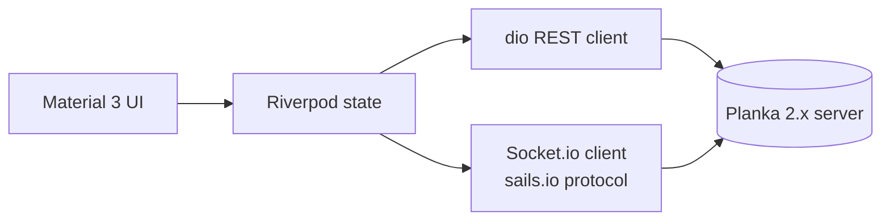

<p align="center">
  
</p>

<p align="center">
  <a href="https://flutter.dev"></a>
  <a href="https://dart.dev"></a>
  
  
</p>

<p align="center">
  A Flutter client for <a href="https://github.com/plankanban/planka">Planka</a>, the open-source kanban board — on mobile and desktop.<br>
  Connect to your self-hosted server and manage boards on the go — with realtime sync.
</p>

---

## Features

- 🔐 **Multi-account** — log in to multiple Planka servers, switch instantly
- 🗂 **Projects & boards** — browse everything you have access to, set project backgrounds, manage project managers
- 🎯 **Kanban board** — drag-and-drop cards across lists, live-synced over WebSocket; filter and sort cards
- 🃏 **Full card details** — description, due dates, labels, members, checklists, attachments, comments, activity feed
- ✏️ **Complete CRUD** — create, rename, edit, and delete cards, lists, labels, checklists, tasks, and comments from the app
- 📦 **Move, duplicate & restore** — move cards across boards and projects, duplicate cards, browse archive/trash and restore
- 👤 **Profile & admin** — edit your profile and avatar; admins can manage server users
- 🔔 **Notifications** — realtime unread badge, mark read / mark all read
- ⚡ **Realtime everywhere** — changes from the web UI appear instantly, and vice versa
- 🔄 **In-app updates** — sideloaded Android builds download and install new releases directly

> **Status:** actively maintained. Feature parity with the Planka web UI is largely complete across cards, boards, projects, and admin.

## Requirements

- A self-hosted **Planka 2.x** server
- Flutter **≥ 3.22** (stable) to build from source

## Getting Started

```bash
git clone https://github.com/adambenhassen/planka-app.git
cd planka-app
flutter pub get
flutter run
```

Sign in with your server URL (e.g. `https://planka.example.com`), email or username, and password.

## Development

A disposable Planka server for development and fixture recording:

```bash
docker compose -f dev/docker-compose.yml up -d   # Planka at http://localhost:3000
./dev/record_fixtures.sh                          # records API fixtures into test/fixtures/
```

Default dev credentials: `demo@demo.demo` / `demo`.

Verify before committing:

```bash
dart analyze && flutter test
```

## Architecture



- **API layer** — `dio` REST client + Socket.io client speaking the sails.io.js virtual-request protocol; freezed models parsed from Planka's `{item, included}` envelope
- **State layer** — Riverpod; one in-memory board state per open board, patched by both REST responses and socket events
- **UI layer** — Material 3: login → projects → board → card sheet → notifications

## Contributing

Issues and pull requests are welcome. Please run `dart analyze && flutter test` before submitting.

## Related Projects

- [planka-mcp](https://github.com/adambenhassen/planka-mcp) — an MCP server for Planka, letting AI assistants manage your boards
- [Planka](https://github.com/plankanban/planka) — the kanban board this app is a client for
